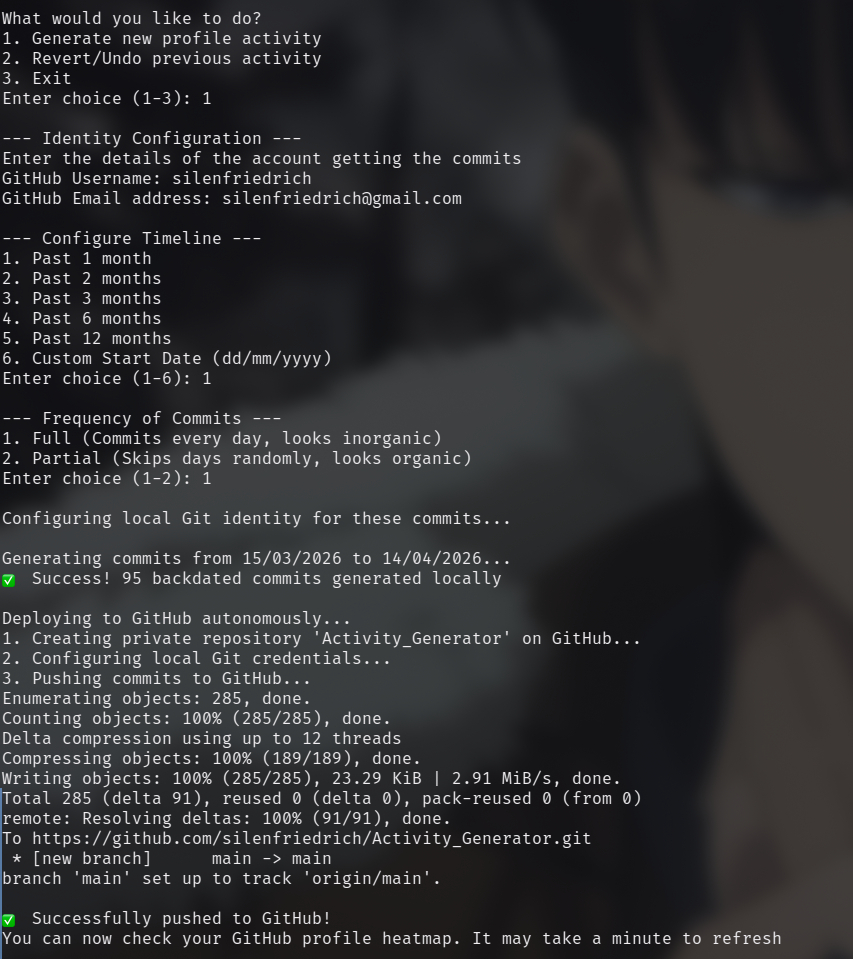
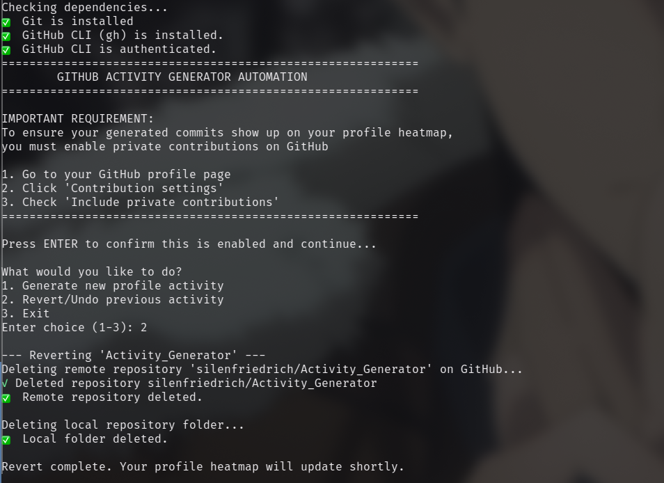

# GitHub Activity Generator

A cross-platform(Windows, Linux, Mac, Termux) Python script that fills up your GitHub profile heatmap with backdated commits. It creates a private repository, generates a natural-looking commit history both partially and fully, and pushes it directly to GitHub without cluttering your public activity.

---

## WHY THIS IS DIFFERENT FROM OTHER ACTIVITY GENERATOR SCRIPTS

* Automatically creates the private remote repository and pushes the commits using the GitHub CLI (`gh`).
* You can choose between "Full" commits that fills up the heatmap with a daily frequency, and the other one is "Partial" commit that randomizes the heatmap pattern by skipping days to make it look more authentic .
* Generate history for the past 1, 2, 3, 6, or 12 months, or specify an exact custom start and end date.
* Automatically isolates the generated commits using local repository configurations (`user.name` and `user.email`). This guarantees your global Git identity is never accidentally overwritten.
* This has a revert back option too which deletes the local folder and the remote repository on GitHub, retaining the original heatmap.
* Works seamlessly on Windows (PowerShell/CMD), macOS, Linux, and Termux.

---

## 🛠️ Prerequisites

Before running the script, ensure you have the following installed:

1. **Python 3.x:** [Download here](https://www.python.org/downloads/)
2. **Git:** * Windows: [Download Git](https://git-scm.com/download/win)
   * Mac: `brew install git`
   * Linux: `sudo apt install git`
3. **GitHub CLI (`gh`):**
   * Windows: `winget install --id GitHub.cli`
   * Mac: `brew install gh`
   * Linux: `sudo apt install gh`

---

## 🚀 How to Use

### Step 1: Enable Private Contributions
For the generated commits to show up on your profile, GitHub needs permission to display private activity.
1. Go to your GitHub profile page.
2. Click **Contribution settings** .
3. Check **Include private contributions**.

### Step 2: Run the Script
1. Download `activity_generator.py` to an empty folder.
2. Open your terminal or PowerShell in that folder.
3. Run the script using python or uv: ```python Activity_Generator_Script.py``` 
4. Go through each and every instructions carefully written in the script for a smoother experience.

> **Note:** Please use the same username and user email that you have set in your account to make changes visible in your heatmap, if you will give different details then the heatmap won't get updated
---
<br>

<table align="center">
  <tr>
    <td align="center"><b>Create Activity (Full)</b></td>
    <td align="center"><b>Revert Activity (Partial)</b></td>
  </tr>
  <tr>
    <td></td>
    <td></td>
  </tr>
</table>

<br>


## Testing with a Sandbox Account 

If you want to test this script on a fresh, secondary GitHub account *without* logging out of your primary account on your machine, you can use a Personal Access Token (`GH_TOKEN`).

### 1. Generating the Token
1. Log into your test account on GitHub in your browser.
2. Go to **Settings > Developer Settings > Personal Access Tokens > Tokens (classic)**.
3. Generate a new token(classic) and check the **`repo`** and **`delete_repo`** scopes.
4. Copy the generated token (`ghp_...`).

### 2. Export the Token to your Terminal
Before running the Python script, set the token as an environment variable in your terminal. This temporarily overrides your global `gh` login for that specific terminal window.

**On Windows (PowerShell):**
```$env:GH_TOKEN="your_copied_token_here"```
**On Linux and Mac(Terminal):**
```export GH_TOKEN="your_copied_token_here"```

### 3. Verify and run

```gh auth status```

4. Then run the script normally. Make sure to enter your test account's username and email when the script prompts you for the identity configuration!

---

## 🗑️ Reverting Changes

To undo the generated activity:

1. Run the script again: python activity_generator.py

2. Select Option 2. Revert/Undo previous activity.

The script will automatically delete the local folder and securely delete the remote repository using the GitHub CLI. Your heatmap will update shortly after.

---

> **Note:**  This is a fun project intended for learning, do not use it to fool others, focus on real projects and learnings as green boxes doesn't guarantee placements but real projects do.
